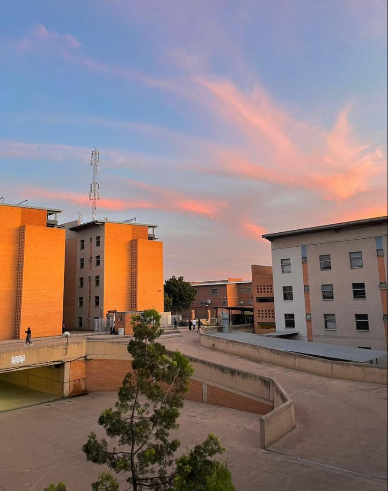
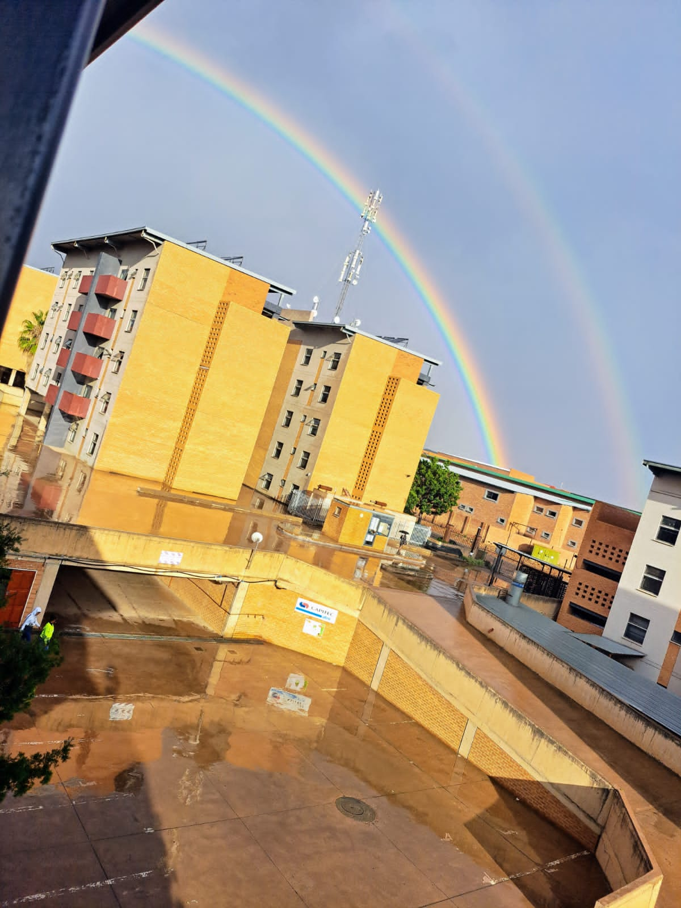
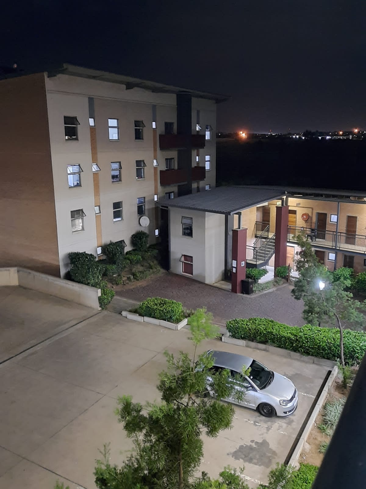
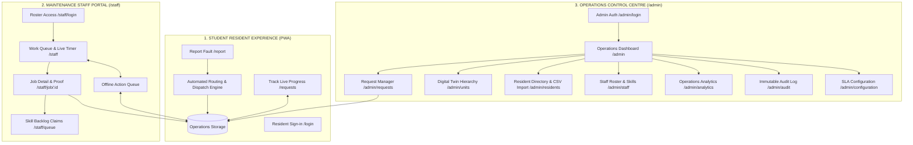

<div align="center">
  

# Corridor Hills Residence

### Digital Maintenance & Residence Operations Platform

**Tshwane University of Technology (TUT) — eMalahleni Campus**

[](https://corridor-hills-residence.vercel.app)
[](https://corridor-hills-residence.vercel.app)
[](https://corridor-hills-residence.vercel.app)
[](./Corridor_Hills_Residence_Stakeholder_Operations_Guide.pdf)

  <p align="center">
    <strong>A high-integrity, closed-loop digital ecosystem connecting Student Residents, On-Site Maintenance Technicians, and University Administration into one seamless operations platform.</strong>
  </p>

[🌐 Live Platform](https://corridor-hills-residence.vercel.app) •
[📄 Stakeholder Guide (PDF)](./Corridor_Hills_Residence_Stakeholder_Operations_Guide.pdf) •
[🛠️ Maintenance Portal](https://corridor-hills-residence.vercel.app/staff/login) •
[📊 Operations Control Centre](https://corridor-hills-residence.vercel.app/admin/login)
</div>

---

## 📸 Architectural Scenery & Visual Identity

The platform embeds authentic, high-resolution architectural photography of Corridor Hills Residence as dynamic ambient backdrops with custom cinematic dark scrims (`#061325/85` $\rightarrow$ `#061325/65` $\rightarrow$ `#061325/95`) and TUT institutional lighting accents (`#0050A0` Institutional Blue & `#10A080` Teal).

<table>
  <tr>
    <td width="33.33%" align="center">
      
      <br />
      <strong>🌅 Evening Glow</strong>
      <br />
      <sub><em>Golden hour sunset over residence blocks.<br />Featured on the <a href="https://corridor-hills-residence.vercel.app/login">Resident Verification Portal</a>.</em></sub>
    </td>
    <td width="33.33%" align="center">
      
      <br />
      <strong>🌈 After the Rain</strong>
      <br />
      <sub><em>Vibrant rainbow horizon over the campus.<br />Featured on the <a href="https://corridor-hills-residence.vercel.app/report">Fault Reporting Portal</a>.</em></sub>
    </td>
    <td width="33.33%" align="center">
      
      <br />
      <strong>🌙 After Hours</strong>
      <br />
      <sub><em>Nocturnal architectural pathway illumination.<br />Featured on <a href="https://corridor-hills-residence.vercel.app/requests">Tracking</a> & <a href="https://corridor-hills-residence.vercel.app/staff">Staff Operations</a>.</em></sub>
    </td>
  </tr>
</table>

> **Interactive Campus Scenery Switcher:** Students can toggle between these three authentic views directly from the platform interface via the floating scenery selector or header button. The platform automatically remembers their preference locally.

---

## 🏛️ Platform Architecture Overview

The platform is strictly segregated into three distinct user domains, each optimized for its exact operational workflow:



---

## 🚀 The Three Specialized Portals

### 1. 🪪 Student Resident Experience (`/`, `/report`, `/requests`, `/login`)

_Designed around: **"Report → Track → Resolve"**_

- **Password-Free Identity Verification:** Authenticates residents using their allocated Block (A–F), Bedroom (A, B, or C), and official 9-digit TUT student number.
- **6-Step Fault Reporting Wizard:** Guided reporting with problem area selection, category tagging, specific issue definitions, and photo/video evidence upload.
- **Offline Draft Protection:** If internet connectivity drops while reporting, draft progress and attachments are saved locally and auto-submitted when reconnected.
- **Real-Time Request Tracker:** Live technician assignment, status timeline, and resident resolution confirmation (_"Yes, it's fixed"_ or _"No, still broken"_).
- **Interactive Scenery Control:** Allows students to switch their ambient background view between _Evening Glow_, _After the Rain_, and _After Hours_.

### 2. 🛠️ Maintenance Staff Portal (`/staff/*`)

_Designed around: **"Receive → Prioritise → Work → Resolve"**_

- **Tactile, Outdoor-Contrast UI:** Engineered for technicians on-site with large touch targets ($\ge 48\text{px}$) and outdoor sunlight readability.
- **1-Tap Technician Roster Access:** Instant technician switching on login without typing passwords.
- **Active Job Card & On-Site Timer:** Real-time labor timer starts when work begins to measure actual repair time accurately.
- **Structured Pauses & Mandatory Justifications:** Allows pausing active jobs for _Parts Needed_, _Access Denied_, or _Specialist Required_, automatically updating the ticket state.
- **Unassigned Skills Backlog (`/staff/queue`):** Technicians can view and claim unassigned tickets filtered by their certified trade skills (Electrical, Plumbing, Carpentry, HVAC, General).
- **Offline Action Queue:** Technician actions (_Accept_, _Start_, _Pause_, _Resolve_) are queued locally with UUID idempotency keys if operating in basements or areas with poor reception.

### 3. 📊 Administration Operations Control Centre (`/admin/*`)

_Designed around: **"Monitor → Control → Analyse → Improve"**_

- **Operations Overview Dashboard (`/admin`):** 6 live KPI cards, SLA Watch Radar, real-time technician fleet status, and live audit feed.
- **Request Manager (`/admin/requests`):** Filter by status, urgency, category, or block with reassignment controls requiring mandatory audit justification.
- **Digital Twin Unit Mapping (`/admin/units`):** Hierarchical view of Blocks A–F, 4 floors, 144 units, and maintenance health scores.
- **Resident Directory (`/admin/residents`):** Search resident allocations and export/import student rosters via CSV.
- **Staff Roster & Skills Matrix (`/admin/staff`):** Manage technician shift statuses (_Available_, _Busy_, _On Break_, _Off Duty_) and certified trade skill sets.
- **Operations Analytics (`/admin/analytics`):** Mean Time to Resolve (MTTR), category distributions, repeat fault heuristic detection, and SLA breach analysis.
- **Immutable Audit Log (`/admin/audit`):** Forensic traceable log of every operational event, status update, dispatch, and override.

---

## 🔑 Demo Access & Testing Credentials

Stakeholders and evaluators can test all three interfaces immediately using pre-configured demo credentials:

### 👤 Student Resident Portal ([Test Here](https://corridor-hills-residence.vercel.app/report))

| Field                 | Value                                                                              | Notes                                      |
| :-------------------- | :--------------------------------------------------------------------------------- | :----------------------------------------- |
| **Residence Unit**    | `F301` _(or A101, E204)_                                                           | Block F (Male Residence), Floor 3, Unit 01 |
| **Allocated Bedroom** | `Room C` _(or A, B)_                                                               | 2 residents per room                       |
| **TUT Student #**     | `220123456`                                                                        | 9-digit official student number            |
| **1-Tap Shortcut**    | Click **"Use sample resident (F301C)"** on the login screen to autofill instantly. |

### 🔧 Maintenance Staff Roster ([Login Here](https://corridor-hills-residence.vercel.app/staff/login))

| Staff ID        | Technician Name   | Specialty / Certified Skills                | Shift Status |
| :-------------- | :---------------- | :------------------------------------------ | :----------- |
| **`CH-ST-001`** | **Sipho Mhlongo** | Electrical Specialist & General Maintenance | Available    |
| **`CH-ST-002`** | **David Khumalo** | Plumbing Specialist & Water Reticulation    | Busy         |
| **`CH-ST-003`** | **Thabo Ndlovu**  | Carpentry, Doors & Access Control           | Available    |
| **`CH-ST-004`** | **Nomsa Zulu**    | Senior Facilities Specialist (HVAC & Power) | On Break     |

### 🛡️ Administration Portal ([Login Here](https://corridor-hills-residence.vercel.app/admin/login))

| Admin ID         | Name                | Role Title                     | Permissions Scope                                      |
| :--------------- | :------------------ | :----------------------------- | :----------------------------------------------------- |
| **`CH-ADM-001`** | **Lerato Molefe**   | Residence Operations Lead      | **SUPER-ADMIN**: Reassign, Staff, Units, Audit, Config |
| **`CH-ADM-002`** | **Katlego Dlamini** | Facilities Dispatch Supervisor | **DISPATCH**: Dispatch, Reassign, SLA Watch, Reports   |

---

## ⚡ 5-Minute End-to-End Closed-Loop Test Sequence

Test how the entire platform operates across user roles in real time:

1. **Report Fault as Student (1 min):**
   - Open [`/report`](https://corridor-hills-residence.vercel.app/report), click **"Use sample resident (F301C)"**.
   - Select **Electrical** $\rightarrow$ **Power Socket Fault** $\rightarrow$ enter a short description $\rightarrow$ click **"Submit Report"**.
   - Note the generated ticket reference (e.g. `REQ-F301-XXXX`). The automated engine assigns it to the on-duty electrical technician.

2. **Execute as Technician (2 mins):**
   - Open [`/staff/login`](https://corridor-hills-residence.vercel.app/staff/login) in a new tab and tap **Sipho Mhlongo (`CH-ST-001`)**.
   - In the **Current Job** card, click **"Accept Work Order"**, then click **"Start Work"** (watch the live timer activate).
   - Click **"Complete Work"**, enter a resolution summary, and submit.

3. **Verify as Student (1 min):**
   - Return to [`/requests`](https://corridor-hills-residence.vercel.app/requests) and click on your ticket.
   - It now shows **"Resolved"**. Click **"Yes, it's fixed"** to close the ticket or **"No, still broken"** to test reopening escalation.

4. **Review as Administrator (1 min):**
   - Open [`/admin/login`](https://corridor-hills-residence.vercel.app/admin/login) and tap **Lerato Molefe (`CH-ADM-001`)**.
   - Check the **Audit Log** ([`/admin/audit`](https://corridor-hills-residence.vercel.app/admin/audit)) to view the immutable event trail.
   - Check **Digital Twin Units** ([`/admin/units`](https://corridor-hills-residence.vercel.app/admin/units)) to see the updated health score of Unit F301.

---

## 💻 Tech Stack & Engineering Standards

- **Core Framework:** React 19, TypeScript, TanStack Router, TanStack Start (SSR & Serverless Edge)
- **Styling & Design System:** Tailwind CSS, CSS Variables, Glassmorphism, Strict Manrope Typography
- **Motion & Interactions:** Framer Motion, GSAP, WebGL OGL Canvas (Gradient Waves), React Bits ScrollExpand
- **Icons & UI Primitives:** Lucide React, Radix UI primitives, Sonner Toast Notifications
- **Resilience:** Service Worker PWA, IndexedDB/LocalStorage Offline Action Queue, Idempotency Keys
- **Quality Gates:** 0 ESLint errors, 0 build errors, automated 9/9 unit operations test suite

---

## 🛠️ Local Development Setup

### Prerequisites

- Node.js (v18.0.0 or higher)
- npm (v9.0.0 or higher)

### Installation

```sh
# Clone the repository
git clone https://github.com/Drey780822/corridor-hills-residence.git
cd corridor-hills-residence

# Install project dependencies
npm install

# Start local development server
npm run dev
```

Open [http://localhost:5173](http://localhost:5173) in your browser.

### Available Scripts

```sh
# Run unit & operations test suite
npx tsx tests/operations.test.ts

# Run static linter
npm run lint

# Format codebase with Prettier
npm run format

# Compile production client & SSR bundle
npm run build

# Preview production build locally
npx vite preview

# Re-generate stakeholder PDF guide (requires headless Chrome)
node scripts/generate-stakeholder-guide-pdf.cjs
```

---

## 📄 Documentation & Resources

- **[Stakeholder Operations Guide (PDF)](./Corridor_Hills_Residence_Stakeholder_Operations_Guide.pdf)** — Official 5-page publication-grade PDF handbook for university executives and operations leadership.
- **[Stakeholder Operations Guide (HTML)](./docs/corridor-hills-stakeholder-guide.html)** — Standalone web-viewable format of the operations handbook.
- **[Brand & Agent Guidelines](./AGENTS.md)** — Architectural principles, TUT brand tokens, and engineering constraints.

---

<div align="center">
  <sub>Tshwane University of Technology &bull; Corridor Hills Residence Digital Platform &bull; Deployed on Vercel</sub>
</div>
